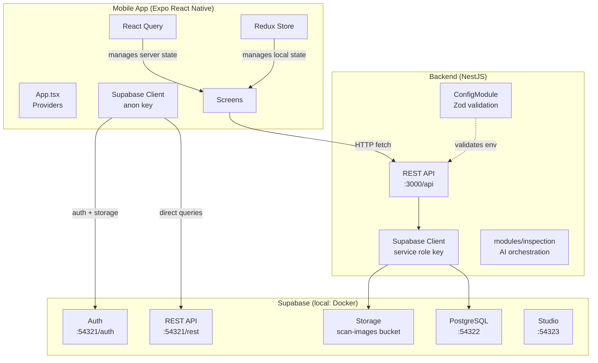
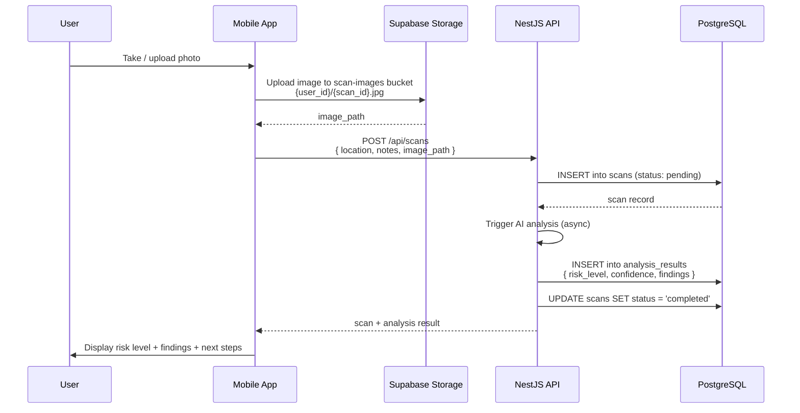
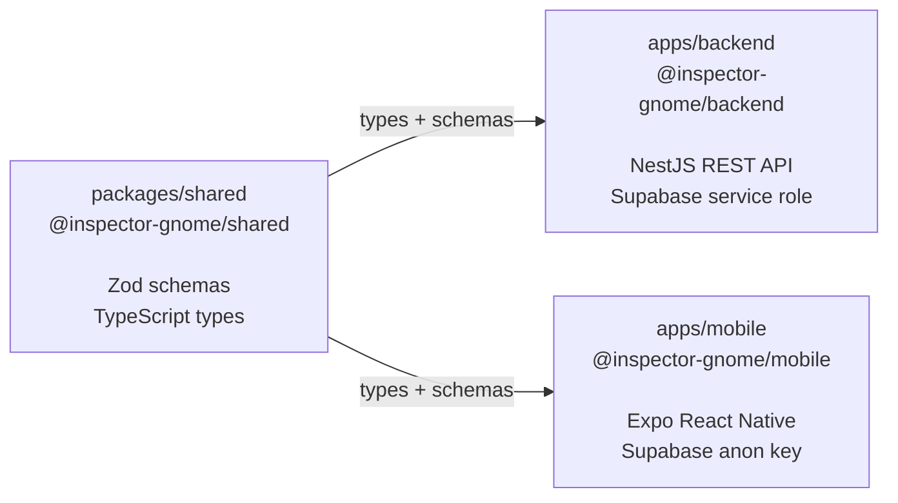

# Architecture

## Overview

Inspector Gnome is a **Turborepo monorepo** with three packages that share TypeScript types via a dedicated shared package. The mobile app communicates with two backends: the NestJS API for business logic and AI orchestration, and Supabase directly for authentication and file uploads.

## System Architecture



## Data Flow — Scan Submission



## Monorepo Package Relationships



The `shared` package must be **built before** `backend` or `mobile` can consume it. Turborepo handles this automatically via `"dependsOn": ["^build"]` in `turbo.json`.

## Tech Stack Details

### Mobile (`apps/mobile/`)

| Library | Role |
|---------|------|
| Expo 55 / React Native 0.83 | Runtime and native API access |
| React Navigation 7 (Native Stack) | Screen navigation |
| Redux Toolkit 2 | Local/UI state (current scan, loading, errors) |
| TanStack React Query 5 | Server state, caching, background refetching |
| React Native Paper 5 | Material Design 3 UI components |
| `@supabase/supabase-js` | Auth sessions + direct Storage uploads |
| Zod 3 | Runtime validation of API responses |
| expo-camera | Photo capture |
| AsyncStorage | Session persistence |

Navigation stack: **Home → Camera → Results** (with `inspectionId` param) / **History**

### Backend (`apps/backend/`)

| Library | Role |
|---------|------|
| NestJS 11 | Framework (DI, modules, decorators) |
| `@nestjs/config` | Environment variable management |
| `@supabase/supabase-js` | Database + storage access (service role) |
| nestjs-zod 4 | Validation pipes using Zod schemas |
| Zod 3 | Schema validation and env validation |

Entry point: `src/main.ts` — global prefix `/api`, CORS enabled, listens on `PORT` (default 3000).

New domain modules follow the pattern `src/modules/<domain>/` with a NestJS module, service, and controller.

To inject the Supabase client:
```typescript
import { Inject } from '@nestjs/common';
import { SUPABASE_CLIENT } from '../config/supabase.config';
import { SupabaseClient } from '@supabase/supabase-js';

constructor(@Inject(SUPABASE_CLIENT) private supabase: SupabaseClient) {}
```

### Shared (`packages/shared/`)

Single file: `src/schemas/inspection.schema.ts` — exports all Zod schemas and TypeScript types for every domain entity:

- Enums: `RiskLevel`, `UserRole`, `ScanStatus`, `ProfessionalType`, `ReferralStatus`
- Entities: `Profile`, `Scan`, `AnalysisResult`, `Finding`, `Professional`, `Referral`
- DTOs: `CreateScan`, `CreateReferral`, `UpdateProfile`

**Always update this file when the database schema changes.**

DB columns are `snake_case`; Zod schemas use `camelCase`. The NestJS service layer handles mapping between them.
