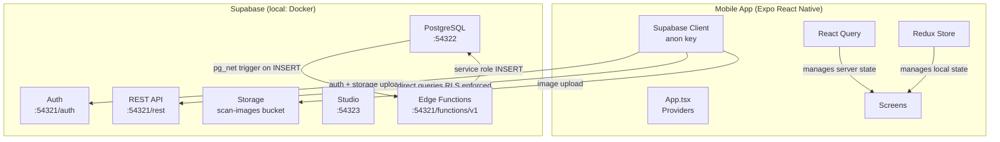
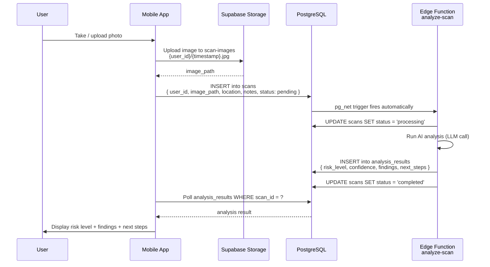
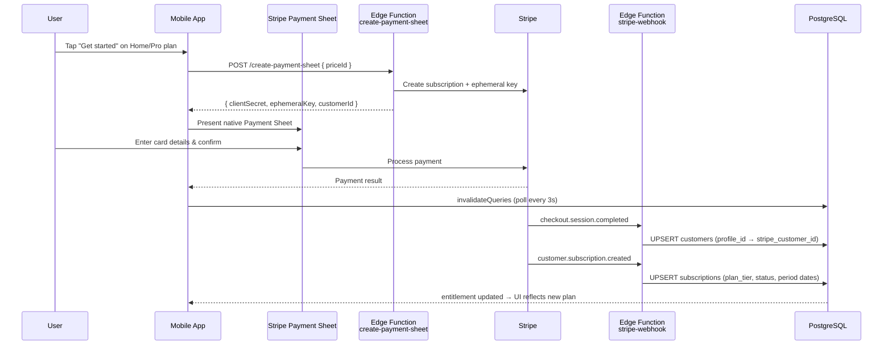
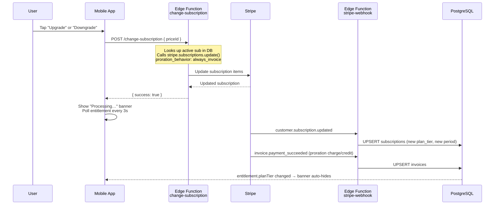
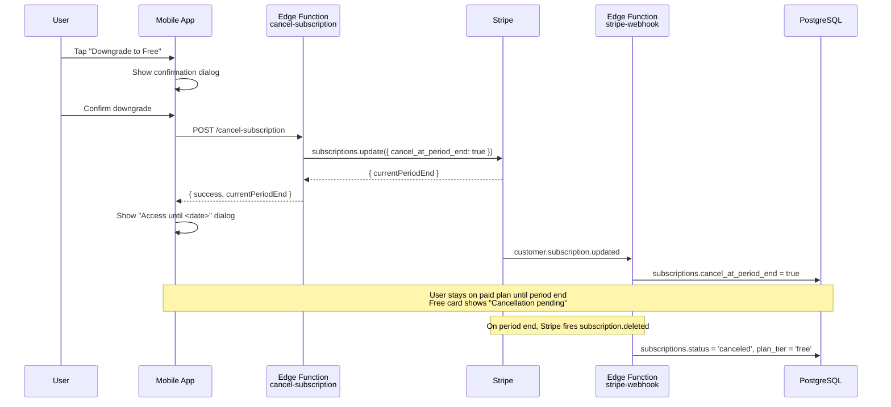
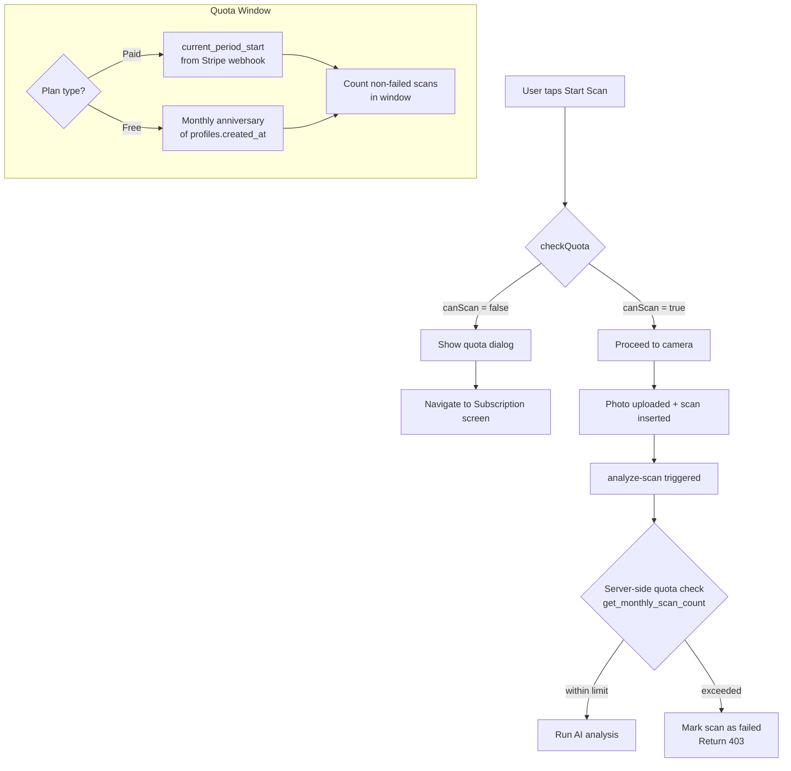
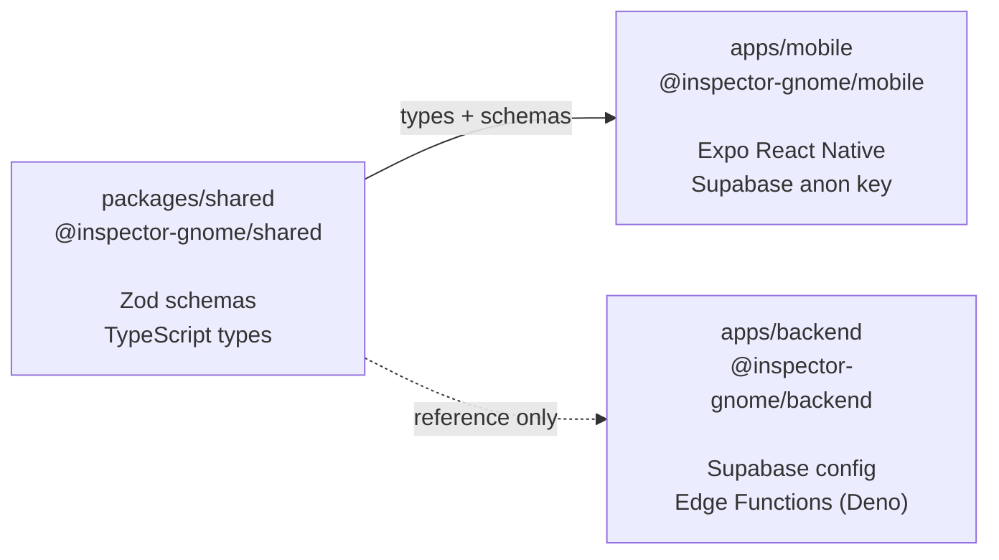

# Architecture

## Overview

Inspector Gnome is a **Turborepo monorepo** with three packages that share TypeScript types via a dedicated shared package. The mobile app communicates directly with Supabase for all operations. AI analysis is handled by a Supabase Edge Function triggered automatically when a scan is created.

## System Architecture



## Data Flow — Scan Submission



## Data Flow — Subscription Lifecycle

### New Subscription (Free → Paid)



### Upgrade / Downgrade (Paid → Paid)



### Cancel to Free



## Scan Quota System



## Monorepo Package Relationships



The `shared` package must be **built before** `mobile` can consume it. Turborepo handles this automatically via `"dependsOn": ["^build"]` in `turbo.json`.

## Tech Stack Details

### Mobile (`apps/mobile/`)

| Library | Role |
|---------|------|
| Expo 55 / React Native 0.83 | Runtime and native API access |
| React Navigation 7 (Native Stack) | Screen navigation |
| Redux Toolkit 2 | Local/UI state (current scan, loading, errors) |
| TanStack React Query 5 | Server state, caching, background refetching |
| React Native Paper 5 | Material Design 3 UI components |
| `@supabase/supabase-js` | Auth sessions + direct Storage uploads + DB queries |
| Zod 3 | Runtime validation |
| expo-camera | Photo capture |
| AsyncStorage | Session persistence |

Navigation stack: **Home → Camera → PhotoReview → Results** / **History**

### Edge Functions (`apps/backend/supabase/functions/`)

Written in **Deno TypeScript**. Uses the `SUPABASE_SERVICE_ROLE_KEY` env var (auto-injected) to bypass RLS when writing results or querying subscription data.

| Function | Trigger | Role |
|----------|---------|------|
| `analyze-scan` | `on_scan_created` Postgres trigger (pg_net) | Runs AI analysis, writes `analysis_results` |
| `stripe-webhook` | Stripe HTTP POST | Receives Stripe events, syncs `subscriptions` and `invoices` tables |
| `get-entitlement` | User request | Returns plan tier, scan quota used/allowed, and billing period dates |
| `get-plans` | User request | Returns available paid plans with Stripe price IDs |
| `create-payment-sheet` | User request | Creates a new Stripe subscription + returns Payment Sheet parameters |
| `change-subscription` | User request | Prorated plan upgrade/downgrade on an existing subscription |
| `cancel-subscription` | User request | Schedules subscription cancellation at period end |
| `create-portal-session` | User request | Returns a Stripe Customer Portal URL for billing management |
| `stripe-setup` | Manual (one-time) | Creates Stripe products, prices, and webhook endpoint |
| `delete-account` | User request | Cancels Stripe subscription and purges all user data |

To create a Supabase client in an Edge Function:
```typescript
import { createClient } from 'https://esm.sh/@supabase/supabase-js@2';

const supabase = createClient(
  Deno.env.get('SUPABASE_URL') ?? '',
  Deno.env.get('SUPABASE_SERVICE_ROLE_KEY') ?? '',
);
```

### Shared (`packages/shared/`)

Single file: `src/schemas/inspection.schema.ts` — exports all Zod schemas and TypeScript types for every domain entity:

- Enums: `RiskLevel`, `UserRole`, `ScanStatus`, `ProfessionalType`, `ReferralStatus`
- Entities: `Profile`, `Scan`, `AnalysisResult`, `Finding`, `Professional`, `Referral`
- DTOs: `CreateScan`, `CreateReferral`, `UpdateProfile`

**Always update this file when the database schema changes.**

DB columns are `snake_case`; Zod schemas use `camelCase`. The mobile app and Edge Functions each handle the mapping.
