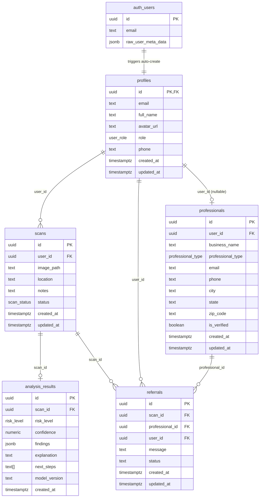

# Database

All database infrastructure lives in `apps/backend/supabase/`. This includes migrations, seed data, and local Supabase configuration.

## Entity Relationship Diagram



## Tables

### `profiles`
Extends `auth.users` in a 1:1 relationship. Created automatically when a user signs up via the `handle_new_user` trigger.

| Column | Type | Notes |
|--------|------|-------|
| `id` | `uuid` | Same as `auth.users.id` (PK + FK) |
| `email` | `text` | Copied from auth on creation |
| `full_name` | `text` | From `raw_user_meta_data.full_name` |
| `avatar_url` | `text` | Optional |
| `role` | `user_role` | Default: `homeowner` |
| `phone` | `text` | Optional |
| `created_at` / `updated_at` | `timestamptz` | Auto-managed |

### `scans`
A photo submission for AI mold analysis.

| Column | Type | Notes |
|--------|------|-------|
| `id` | `uuid` | Generated |
| `user_id` | `uuid` | FK → `profiles.id` |
| `image_path` | `text` | Storage path: `{user_id}/{filename}` |
| `location` | `text` | User-described location (e.g. "Bathroom ceiling") |
| `notes` | `text` | Optional user notes |
| `status` | `scan_status` | `pending → processing → completed / failed` |

### `analysis_results`
The AI output for a completed scan. Written exclusively by the `analyze-scan` Edge Function (service role).

| Column | Type | Notes |
|--------|------|-------|
| `scan_id` | `uuid` | FK → `scans.id` |
| `risk_level` | `risk_level` | `low`, `moderate`, or `high` |
| `confidence` | `numeric(5,4)` | Range 0.0000 – 1.0000 |
| `findings` | `jsonb` | Array of finding objects `{ type, description, location?, severity? }` |
| `explanation` | `text` | Plain-language explanation for the homeowner |
| `next_steps` | `text[]` | Ordered list of recommended actions |
| `model_version` | `text` | AI model identifier (e.g. `inspector-gnome-v1.0`) |

### `professionals`
The referral directory. `user_id` is nullable — a professional can be in the directory before having an app account.

| Column | Type | Notes |
|--------|------|-------|
| `professional_type` | `professional_type` | `inspector`, `remediation`, `plumber`, `hvac` |
| `is_verified` | `boolean` | Manually verified by admins |
| `city`, `state`, `zip_code` | `text` | Location for local matching |

### `referrals`
Connects a user's scan to a professional.

| Column | Type | Notes |
|--------|------|-------|
| `status` | `text` | `pending`, `accepted`, `declined`, `completed` |
| `message` | `text` | Optional message from the user to the professional |

## Enum Types

| Enum | Values |
|------|--------|
| `risk_level` | `low`, `moderate`, `high` |
| `user_role` | `homeowner`, `property_manager`, `renter`, `professional` |
| `scan_status` | `pending`, `processing`, `completed`, `failed` |
| `professional_type` | `inspector`, `remediation`, `plumber`, `hvac` |

## Storage

**Bucket:** `scan-images`
- **Visibility:** Private (signed URLs required)
- **File size limit:** 10 MB
- **Allowed MIME types:** `image/jpeg`, `image/png`, `image/webp`, `image/heic`
- **Path convention:** `{user_id}/{filename}` — the first path segment is always the user's UUID

Also configured in `apps/backend/supabase/config.toml`:
```toml
[storage.buckets.scan-images]
public = false
file_size_limit = "10MiB"
allowed_mime_types = ["image/jpeg", "image/png", "image/webp", "image/heic"]
```

## Row Level Security (RLS)

All tables have RLS enabled. **Edge Functions use the service role key** (bypasses RLS). The **mobile Supabase client uses the anon key** (subject to RLS).

| Table | Policy Summary |
|-------|---------------|
| `profiles` | Users can view and update their own profile only |
| `scans` | Users can view, create, update, delete their own scans |
| `analysis_results` | Users can view results for their own scans; INSERT is service-role only |
| `professionals` | All authenticated users can view the directory; professionals can update their own listing |
| `referrals` | Users can view/create their own referrals; professionals can view/update referrals directed to them |

**Storage RLS:** Users can upload, view, and delete files only within their own `{user_id}/` folder.

## Triggers

### `handle_new_user`
Runs after every `INSERT` on `auth.users`. Auto-creates a `profiles` row with the new user's `id`, `email`, and `full_name`/`avatar_url` from `raw_user_meta_data`.

```sql
-- Defined in: 20260324224647_create_schema.sql
CREATE TRIGGER on_auth_user_created
  AFTER INSERT ON auth.users
  FOR EACH ROW EXECUTE FUNCTION public.handle_new_user();
```

### `update_updated_at`
Runs before every `UPDATE` on `profiles`, `scans`, `professionals`, and `referrals`. Sets `updated_at = now()`.

## Indexes

| Index | Table | Columns |
|-------|-------|---------|
| `idx_scans_user_id` | `scans` | `user_id` |
| `idx_scans_status` | `scans` | `status` |
| `idx_analysis_scan_id` | `analysis_results` | `scan_id` |
| `idx_professionals_type` | `professionals` | `professional_type` |
| `idx_professionals_location` | `professionals` | `city, state` |
| `idx_referrals_user` | `referrals` | `user_id` |
| `idx_referrals_professional` | `referrals` | `professional_id` |
